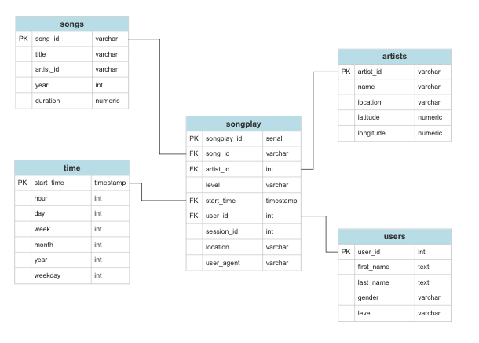
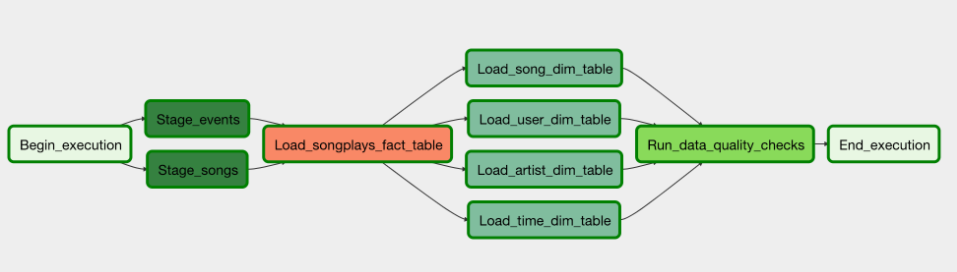

# Data Pipeline: Processing Sparkify's data with Airflow on AWS Redshift and S3.

### Introduction
With Airflow the ETL process is now automated from end to end where data ingestion is scheduled and can be monitored without the need to execute code every time new data is retrieved.

## REQUIREMENTS
1) In Redshift tables have to be created before execution of the DAG on Airflow. The create_tables.sql can be used on Redshift's editor.
2) A Redshift Postgres and Amazon Web Services connection must be available in Airflow.
3) The data warehouse schema is generated from two types of source files: **Song Data** and **Log Data** located in s3. These are the files processed by the DAG. 

### RESULT

#### S3 datasets 
LOG_DATA='s3://udacity-dend/log_data'

SONG_DATA='s3://udacity-dend/song_data'

These are located in a s3 bucket in the us-west-2 region and both in json format. 

### RUN
A prequesite to run the udac_example_dag.py script we will run a Redshift cluster on AWS in the us-west-2 region.

## CONTENT
**dags**
- udac_example_dag.py
Intializes de DAG, creates the tasks, and sets the pipeline flow to produce staging and later fact and dimensions tables with a QA step to produce Sparkify's star schema warehouse inside Redshift. 
**operators**
- data_quality.py
A airflow custom operator to verify data is being retrieved from sources and dimension tables have been populated.
- load_dimension.py
Defines a custom operator to load dimension tables which can handle all sql insert statements.
- load_fact.py
Custom operator that uses staging tables to generate the fact table and allows data to be truncated or appended through the task parameters.
- stage_redshift.py
First operator in the DAG that loads data to Redshift into staging tables and works with log_data and song_data.
**helpers**
- sql_queries.py
Set of sql queries used by tasks in the DAG to insert data from staging to dimensions and fact tables.

## OUTPUT
All tables will be stored in a Postgres database in the us-west-2 region within Redshift.

### DAG PIPELINE

## TERMINATE CLUSTER
The schedule in the Airflow DAG requires the Redshift cluster to be running at all times for the data warehouse to be updated. It can only be paused if the Airflow DAG is paused.
